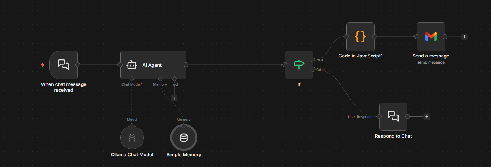

# 📧 Email AI Assistant

An AI-powered email automation workflow that allows users to send emails using natural language instructions.

The user simply tells the AI who they want to email and what they want to say, and the system generates and sends the email automatically through an integrated workflow.

## 🚀 Features

- 🤖 AI-driven email generation from natural language prompts
- 📩 Automatic email sending through Gmail integration
- 🔄 Workflow-based architecture for easy customization
- 🧠 Built with an AI Agent and memory support
- 🛠️ Easily extensible for future capabilities

## 🔮 Planned Features

This project is designed to evolve with additional capabilities, including:

- Receiving incoming emails
- Automatic AI-generated replies
- Context-aware conversations
- Multi-step email workflows
- Support for multiple email providers
- Conversation history and memory improvements

## 🏗️ Workflow Overview

The current workflow processes user requests as follows:

1. User sends a chat message.
2. The AI Agent interprets the request.
3. A conditional check validates the action.
4. JavaScript logic prepares the email.
5. The email is sent automatically via Gmail.

## 📸 Workflow Screenshot

## 🛠️ Tech Stack

- AI Agent
- Ollama Chat Model
- JavaScript
- Gmail Integration
- Workflow Automation
- Simple Memory

## 💡 Example

**User Prompt:**

> Send an email to John and tell him that our meeting has been moved to tomorrow at 10 AM.

**AI Action:**

- Generates a properly formatted email.
- Sends it to the specified recipient through Gmail.

## 📌 Future Vision

The long-term goal of **Email AI Assistant** is to become an intelligent email agent capable of handling complete email communication autonomously, including understanding context, receiving messages, and responding on behalf of the user when appropriate.

---

Feel free to contribute or extend the workflow with new automation features.
